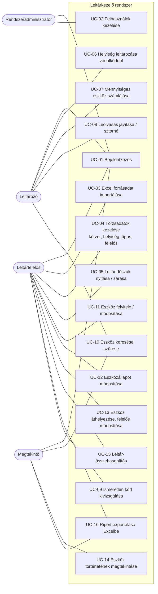
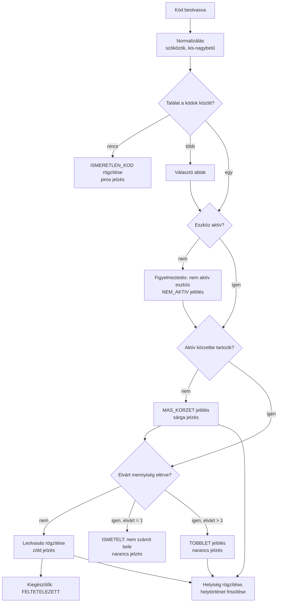

# Felhasználók és felhasználási esetek (első változat)

## 1. Szereplők (aktorok)

| Szerepkör | Ki ez a valóságban? | Fő feladatai | Jogosultság (első elképzelés) |
|---|---|---|---|
| **Rendszeradminisztrátor** | Informatikai munkatárs | Felhasználók, szerepkörök, rendszerbeállítások | Minden, kivéve lezárt leltár módosítása |
| **Leltárfelelős** | Gazdasági osztály / leltárbizottság vezetője | Import, leltáridőszak nyitása/zárása, törzsadatok, eszközállapotok, riportok | Törzsadatok írása, összes körzet |
| **Leltározó** | Leltárbizottsági tag, intézeti munkatárs | Helyszíni beolvasás, saját leolvasások javítása | Leolvasás a kijelölt körzet(ek)ben, olvasás |
| **Megtekintő** | Intézetvezető, eszközért felelős személy | Saját egysége/eszközei állapotának megtekintése, riport letöltése | Csak olvasás, szűkített körben |

> **Feltételezés:** az „eszközért felelős személy” (akinek a nevén az eszköz van) **nem feltétlenül felhasználó** a
> rendszerben. Ezért a `FelelosSzemely` és a `Felhasznalo` külön entitás, amelyek opcionálisan összekapcsolhatók.

## 2. Felhasználási esetek áttekintése

| ID | Felhasználási eset | Elsődleges szereplő | Prioritás |
|---|---|---|---|
| UC-01 | Bejelentkezés | Mindenki | Must |
| UC-02 | Felhasználók és szerepkörök kezelése | Adminisztrátor | Must |
| UC-03 | Excel forrásadat importálása | Leltárfelelős | Must |
| UC-04 | Törzsadatok kezelése (körzet, helyiség, típus, felelős, kódtípus) | Leltárfelelős | Must |
| UC-05 | Leltáridőszak nyitása / zárása | Leltárfelelős | Must |
| UC-06 | Helyiség leltározása vonalkóddal | Leltározó | Must |
| UC-07 | Mennyiséges eszköz számlálása | Leltározó | Must |
| UC-08 | Leolvasás javítása / sztornózása | Leltározó, Leltárfelelős | Must |
| UC-09 | Ismeretlen kód kivizsgálása, eszközhöz rendelése | Leltárfelelős | Should |
| UC-10 | Eszköz keresése, szűrése | Mindenki | Must |
| UC-11 | Eszköz felvitele / módosítása | Leltárfelelős | Must |
| UC-12 | Eszközállapot módosítása (selejtezés, elveszett…) | Leltárfelelős | Must |
| UC-13 | Eszköz áthelyezése, felelős módosítása | Leltárfelelős | Must |
| UC-14 | Eszköz történetének megtekintése | Mindenki | Must |
| UC-15 | Leltár-összehasonlítás | Leltárfelelős | Must |
| UC-16 | Riport exportálása Excelbe | Leltárfelelős, Megtekintő | Must |

## 3. Részletes felhasználási esetek

### UC-06 – Helyiség leltározása vonalkóddal

| | |
|---|---|
| **Szereplő** | Leltározó |
| **Cél** | Egy helyiségben lévő összes eszköz beolvasása az aktuális leltáridőszakban |
| **Előfeltétel** | Bejelentkezett; van nyitott leltáridőszak; a leltározónak van jogosultsága a körzethez |
| **Utófeltétel** | Minden beolvasás leolvasásként rögzítve időszakkal, helyiséggel, felhasználóval, időbélyeggel |

**Alapfolyamat**
1. A leltározó megnyitja a *Leltározás* képernyőt.
2. Kiválasztja a leltáridőszakot (alapértelmezés: az egyetlen nyitott időszak) és az aktív leltárkörzetet.
3. Kiválasztja vagy beolvassa a helyiséget (a helyiségnek is lehet vonalkódja).
4. A rendszer megmutatja a helyiséghez korábban kötött és a körzetben még be nem olvasott eszközöket.
5. A leltározó beolvassa az eszköz kódját; a kurzor mindig a beolvasó mezőben áll.
6. A rendszer azonosítja az eszközt, rögzíti a leolvasást, és **zöld** visszajelzést ad (megnevezés, kód, darabszám).
7. A fő eszköz kiegészítőit a rendszer „feltételezetten megtalált” állapotúnak jelöli.
8. Az 5–7. lépés ismétlődik, amíg a helyiség elkészül; ezután a leltározó új helyiséget választ.

**Alternatív folyamatok**
- **5a – Ismeretlen kód:** a rendszer **piros** jelzést ad, és a leolvasást *ismeretlen kódként* rögzíti későbbi kivizsgálásra (UC-09).
- **5b – Több eszközre illeszkedő kód:** a rendszer választóablakot mutat a lehetséges eszközökkel.
- **6a – Másik körzet eszköze:** **sárga** jelzés („Ez az eszköz a(z) X körzetbe tartozik”), a leolvasás *más körzet* jelöléssel mentődik – megerősítés nem szükséges, hogy a munka ne lassuljon.
- **6b – Egyedi eszköz ismételt beolvasása:** **narancs** figyelmeztetés („Már beolvasva: ma 10:42, 112-es szoba”); a darabszám nem nő, az esemény naplózódik.
- **6c – Mennyiséges eszköz elvárt darabszámon felül:** figyelmeztetés *többletről*, a leolvasás többletként mentődik.
- **6d – Nem aktív (pl. selejtezett) eszköz került elő:** figyelmeztetés, a leolvasás rögzítődik, a leltárfelelős később dönt az állapotról.
- **6e – Az eszköz korábban más helyiségben volt:** a rendszer jelzi az áthelyezést, és új helytörténeti bejegyzést készít.
- **5c – Nincs vonalkódolvasó (demó):** kód beillesztése Ctrl+V-vel, vagy tesztkód-generálás billentyűkombinációval (pl. Ctrl+Shift+R: véletlen érvényes kód, Ctrl+Shift+E: érvénytelen kód).

### UC-07 – Mennyiséges eszköz számlálása

1. A leltározó beolvassa egy mennyiséges eszköz (pl. 30 db-os székkészlet) kódját.
2. A rendszer megmutatja: *elvárt 30 db · eddig 0 db · hiányzik 30 db*.
3. A leltározó vagy minden darabot egyenként beolvas (+1), vagy megadja a megszámolt mennyiséget (pl. +27).
4. A rendszer frissíti az állapotot: *elvárt 30 · beolvasva 27 · hiányzik 3*.
5. Ha a beolvasott érték meghaladja az elvártat, a különbség **többletként** jelenik meg.

### UC-08 – Leolvasás javítása / sztornózása

1. A leltározó a *Leolvasási napló* listában kiválasztja a hibás leolvasást (pl. véletlen dupla beolvasás).
2. A *Sztornó* műveletet választja, és indokot ad (kötelező, pl. „véletlen dupla beolvasás”).
3. A rendszer a leolvasást **nem törli**, hanem sztornózottnak jelöli (ki, mikor, miért); a darabszámokból kikerül.
4. Lezárt leltáridőszakban sztornó nem lehetséges.

### UC-15 – Leltár-összehasonlítás

1. A leltárfelelős kiválaszt egy leltáridőszakot és opcionálisan körzetet / helyiséget / típust.
2. A rendszer összeveti az időszak **elvárt állományát** a nem sztornózott leolvasásokkal.
3. Az eredmény kategóriánként jelenik meg: *megtalált · hiányzó · részben megtalált (mennyiségi hiány) · többlet · más körzetből előkerült · ismeretlen kód · nem aktív eszköz előkerült*.
4. Összesítő sáv: elvárt tételszám és darabszám, megtalálási arány körzetenként.
5. Bármely kategória exportálható Excelbe (UC-16).

## 4. A leltározási folyamat áttekintése

```mermaid
flowchart LR
    A[Excel import<br/>elvárt állomány] --> B[Törzsadatok<br/>körzet, helyiség, felelős]
    B --> C[Leltáridőszak nyitása<br/>elvárt állomány rögzítése]
    C --> D[Helyszíni beolvasás<br/>helyiségenként]
    D --> E[Javítások<br/>sztornó, ismeretlen kódok]
    E --> F[Összehasonlítás]
    F --> G[Eltérések rendezése<br/>állapot, áthelyezés]
    G --> H[Leltáridőszak lezárása]
    H --> I[Riportok, export]
```

## 5. Egy beolvasás feldolgozásának logikája

