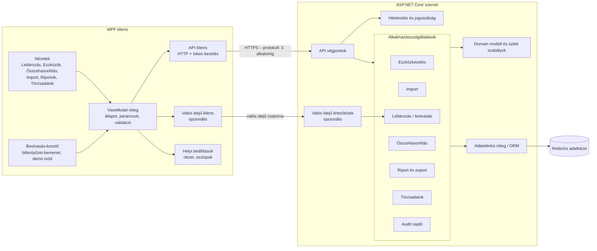
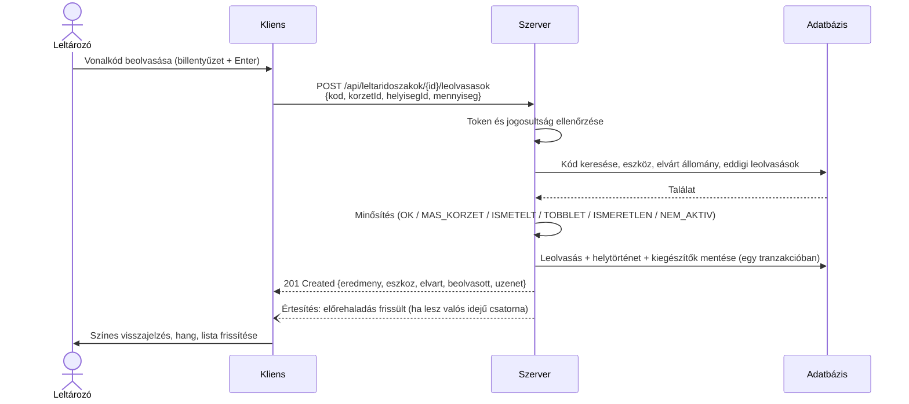

# Kliens–szerver architektúra – első elképzelés

## 1. Alapelvek

1. **Vékony kliens, okos szerver:** minden üzleti szabály (azonosítás, mennyiségkezelés, körzeteltérés, összehasonlítás,
   import-validáció, export) a szerveren fut. A kliens megjelenít, adatot gyűjt és a szerver szolgáltatásait hívja.
2. **Rétegzett szerver:** API ← alkalmazásszolgáltatások ← domain ← adatelérés. Egy új követelmény jellemzően egy új
   szolgáltatás + végpont, nem újratervezés.
3. **Szerződésalapú kommunikáció:** a kliens és a szerver közötti adatstruktúrák (DTO-k) dokumentáltak (OpenAPI).
4. **Semmi nem törlődik:** a módosítások eseményként/történetként tárolódnak.
5. **Bemutathatóság:** a szerver és az adatbázis egyszerűen, demóadatokkal indítható (a futtatási mód a 3. alkalomig dől el).

> **Választott technológia:** WPF kliens + ASP.NET Core szerver (oktatói jóváhagyásra vár).
> Az adatbázis és a kommunikációs protokoll még **nyitott részdöntés** (lásd `05_Technologiai_osszevetes.md`).

## 2. Komponensdiagram

## 3. Felelősségek szétválasztása

| Feladat | Kliens | Szerver |
|---|---|---|
| Vonalkód-bemenet fogadása, demó mód | ✅ | |
| Beolvasott kód azonosítása, leolvasás minősítése | | ✅ |
| Visszajelzés megjelenítése (szín, hang) | ✅ | |
| Excel fájl kiválasztása és feltöltése | ✅ | |
| Excel feldolgozása, validálása, importálása | | ✅ |
| Riport paraméterek összeállítása | ✅ | |
| Riport előállítása (xlsx) | | ✅ |
| Riport mentése a felhasználó gépére | ✅ | |
| Szűrés, rendezés, lapozás nagy adatmennyiségen | kérés összeállítása | végrehajtás (adatbázisban) |
| Jogosultság ellenőrzése | csak a menük elrejtése | ✅ kötelező ellenőrzés |
| Audit napló | | ✅ |

## 4. Egy beolvasás útja

*REST-stílusú hívással szemléltetve – a végleges protokoll a 3. alkalomig dől el.*

## 5. Első API-vázlat (erőforrások)

*REST-stílusban leírva; gRPC választása esetén ugyanezek a műveletek szolgáltatásmetódusokként jelennek meg.*

| Módszer | Végpont | Leírás |
|---|---|---|
| POST | `/api/auth/login` | Bejelentkezés, token |
| GET | `/api/eszkozok?szuro…&oldal…` | Eszközlista szűréssel, lapozással |
| GET | `/api/eszkozok/{id}` | Eszköz részletei (kódok, kiegészítők, aktuális hely, felelős) |
| POST / PUT | `/api/eszkozok`, `/api/eszkozok/{id}` | Felvitel, módosítás |
| POST | `/api/eszkozok/{id}/allapotvaltozasok` | Állapotváltozás (logikai törlés is) |
| GET | `/api/eszkozok/{id}/tortenet` | Állapot-, hely-, felelős- és adattörténet |
| POST | `/api/eszkozok/{id}/athelyezesek` | Kézi áthelyezés |
| POST | `/api/importok` | Excel feltöltés és import indítása |
| GET | `/api/importok/{id}` | Import eredménye, hibák |
| GET / POST | `/api/leltarkorzetek`, `/api/helyisegek`, `/api/eszkoztipusok`, `/api/felelosok`, `/api/kodtipusok` | Törzsadatok |
| POST | `/api/leltaridoszakok` | Új leltáridőszak (elvárt állomány pillanatképpel) |
| POST | `/api/leltaridoszakok/{id}/lezaras` | Lezárás |
| POST | `/api/leltaridoszakok/{id}/leolvasasok` | Beolvasás |
| POST | `/api/leolvasasok/{id}/sztorno` | Sztornó indoklással |
| GET | `/api/leltaridoszakok/{id}/osszehasonlitas?kategoria…` | Összehasonlítás |
| GET | `/api/riportok/{tipus}.xlsx?…` | Excel riport |

## 6. Nyitott architekturális kérdések (3. alkalomig)

- Kommunikációs protokoll (REST / gRPC) és kell-e valós idejű csatorna (SignalR)?
- Adatbázis-kezelő kiválasztása.
- Kell-e kliensoldali várakozási sor gyenge hálózat esetére?
- Egy vagy több kliensalkalmazás (pl. külön egyszerűsített „leltározó” és „admin” felület)? – *Előzetesen: egy alkalmazás, szerepkör szerint eltérő menüvel.*
- Hitelesítés: saját felhasználókezelés vagy egyetemi címtár szimulálása?
- Hol készüljön a riport – a szerveren (javasolt) vagy a kliensen a letöltött adatokból?
- Közös C# DTO-könyvtár a kliens és a szerver között, vagy OpenAPI-ból generált kliens?
