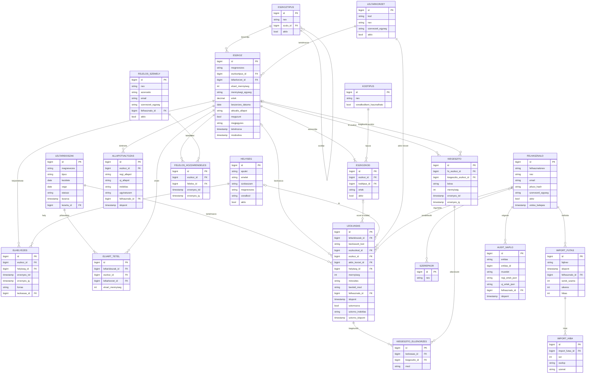

# Adatmodell – első elképzelés

Az adatmodell négy logikai területre bontható. A kiírás legfontosabb elvárása: **az elvárt állomány (forrásadatok)
és a leltározási eredmények elkülönítése**, valamint **a hely, a felelős és az állapot történetének megőrzése**.

| Terület | Entitások | Jelleg |
|---|---|---|
| **A – Törzs- és forrásadatok** | Eszkoz, EszkozKod, KodTipus, EszkozTipus, Leltarkorzet, Kiegeszito | Az elvárt állomány; ritkán változik |
| **B – Leltározás** | LeltarIdoszak, ElvartTetel, Leolvasas, KiegeszitoEllenorzes | Időszakonként elkülönülő eredmények |
| **C – Történeti adatok** | Helyiseg, Elhelyezes, FelelosSzemely, FelelosHozzarendeles, AllapotValtozas | Érvényességi időszakos / eseményalapú |
| **D – Rendszer** | Felhasznalo, Szerepkor, ImportFutas, ImportHiba, AuditNaplo | Hozzáférés, követhetőség |

## 1. ER-vázlat

## 2. Kulcs tervezési szabályok

| # | Szabály | Kiírás pont |
|---|---|---|
| 1 | Az `ESZKOZ` nem tartalmaz helyet; a hely az `ELHELYEZES` táblában van érvényességi időszakkal. | 10 |
| 2 | Egy eszköznek bármennyi kódja lehet (`ESZKOZKOD`); az aktív kódok értéke egyedi (részleges egyedi index). | 5 |
| 3 | A leolvasás **esemény**; a beolvasott darabszám = a nem sztornózott `LEOLVASAS.mennyiseg` összege. | 6, 8 |
| 4 | A `LEOLVASAS` eltárolja a nyers beolvasott kódot is → ismeretlen kódnál az `eszkoz_id` üres. | 3 |
| 5 | `minosites`: `OK`, `MAS_KORZET`, `ISMETELT`, `TOBBLET`, `ISMERETLEN_KOD`, `NEM_AKTIV`. | 4, 6 |
| 6 | `beviteli_mod`: `OLVASO`, `BEILLESZTES`, `KEZI`, `DEMO` – a demó beolvasások kiszűrhetők. | 3 |
| 7 | Az `ELVART_TETEL` a leltáridőszak nyitásakor készül → a régi leltárak a forrásadatok későbbi változása után is reprodukálhatók. | 8 |
| 8 | `KIEGESZITO_ELLENORZES.mod`: `KOZVETLEN` vagy `FELTETELEZETT`. | 7 |
| 9 | Nincs fizikai törlés: `megszunt`/`aktiv` jelzők, `ALLAPOTVALTOZAS` időbélyeggel. | 9 |
| 10 | Az `ESZKOZTIPUS` és a `KODTIPUS` adatbázisban tárolt, bővíthető lista – nem beégetett felsorolás. | 12, 5 |
| 11 | Minden adatmódosítás az `AUDIT_NAPLO`-ba is bekerül (régi és új érték). | 9, 19 |

## 3. Nyitott adatmodell-kérdések (3. alkalomig)

- Az `aktualis_allapot` az `ESZKOZ` táblában tárolt (gyors lekérdezés) vagy mindig az `ALLAPOTVALTOZAS`-ból számolt? – *Javaslat: tárolt, tranzakcióban frissítve, a történet a külön táblában.*
- Kell-e a leltárkörzet-hozzárendelésnek is történet (eszköz átkerülhet másik körzetbe)?
- A forrás Excel többi oszlopa (amit most nem ismerünk) hogyan tárolható rugalmasan? – *Lehetőség: egyedi mezők táblája vagy JSON oszlop.*
- Kell-e külön `LeltarBizottsag` entitás (ki vett részt az adott leltárban)?
- Mennyiséges eszközöknél indokolt-e darabszintű sorozatszámkezelés?
