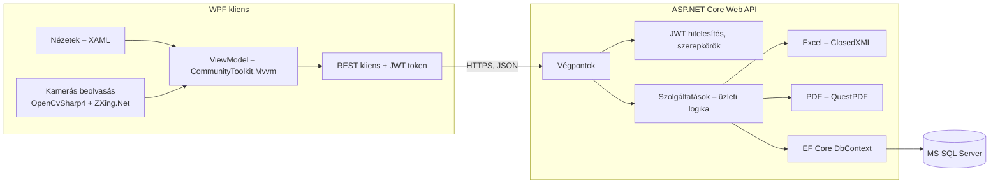

# Technológiai döntések

**Felelős:** közös · **Állapot:** a 3. alkalomra véglegesítve (az oktatói jóváhagyás a 3. alkalmon)

A 2. alkalom anyagában (`02_alkalom/05_Technologiai_osszevetes.md`) nyitva hagyott részdöntések eredménye.
A részletes indoklás, az alternatívák és a következmények a döntési naplóban találhatók (`docs/dontesi_naplo.md`).

| Terület | Döntés | Döntési napló |
|---|---|---|
| Kliens | **WPF** (.NET, C#) | D-004 |
| MVVM a kliensen | **CommunityToolkit.Mvvm** | D-014 |
| Szerver | **ASP.NET Core Web API** | D-004 |
| Kommunikáció | **REST** (HTTPS, JSON) | D-007 |
| Adatbázis | **Microsoft SQL Server** | D-005 |
| Adatelérés | **Entity Framework Core**, kód alapú migrációk | D-006 |
| Hitelesítés | **Saját felhasználókezelés + JWT token** | D-015 |
| Excel import és export | **ClosedXML** | D-008 |
| Kiegészítő funkció | **OpenCvSharp4**, **ZXing.Net**, **QuestPDF** | D-009 |
| WPF megjelenés, stíluskönyvtár | **Nyitott** – Bárkányi Máté dönt a képernyőtervekkel együtt | D-016 |

## A rendszer egy képben

## Mit jelent ez a fejlesztéshez?

| Teendő | Ki | Mikorra |
|---|---|---|
| SQL Server (Developer vagy Express) telepítése mindenkinél | Mindenki | 4. alkalom előtt |
| .NET SDK és Visual Studio / Rider azonos verzióval | Mindenki | 4. alkalom előtt |
| Megoldásstruktúra: `Kliens` (WPF), `Szerver` (ASP.NET Core), `Kozos` (DTO-k) | Horváth Máté | 4. alkalom |
| Első EF Core migráció az adatmodell v1 alapján | Kiss Barnabás | 4. alkalom |
| JWT beállítás: a titkos kulcs **nem** kerül a repóba (felhasználói titkok / környezeti változó) | Horváth Máté | 4. alkalom |
| Stíluskönyvtár kiválasztása | Bárkányi Máté | a képernyőtervekkel együtt |
