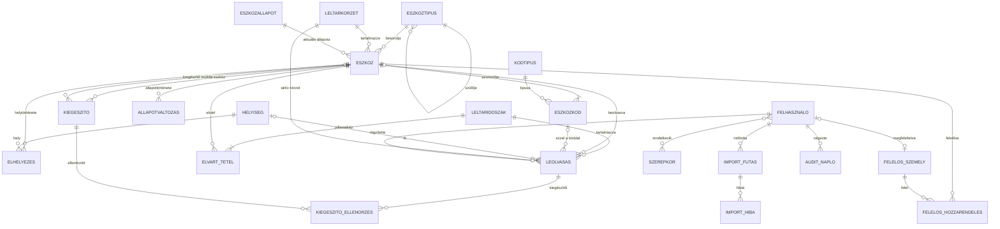

# Adatmodell v1

**Felelős:** Kiss Barnabás · **Állapot:** első teljes változat a 3. alkalomra
**Adatbázis:** Microsoft SQL Server · **Adatelérés:** Entity Framework Core, kód alapú migrációkkal

A modell a 2. alkalom vázlatára épül (`02_alkalom/07_Adatmodell_vazlat.md`), kiegészítve a kulcsokkal, indexekkel,
megszorításokkal és az EF Core-ra vonatkozó megvalósítási döntésekkel.

## 1. Tervezési elvek

| # | Elv | Megvalósítás |
|---|---|---|
| 1 | Az elvárt állomány és a leltáreredmény elkülönül | Törzsadat-táblák vs. `LeltarIdoszak`, `ElvartTetel`, `Leolvasas` |
| 2 | Nincs fizikai törlés | `Aktiv` jelző, `EszkozAllapot`, `AllapotValtozas` (D-001) |
| 3 | A beolvasás esemény | `Leolvasas` sorok, sztornóval javítva (D-002) |
| 4 | A történeti adat üzleti adat | `Elhelyezes`, `FelelosHozzarendeles` érvényességi időszakkal (D-011) |
| 5 | Minden módosítás nyomon követhető | `AuditNaplo` + létrehozás/módosítás mezők |
| 6 | Bővíthetőség | Kódtáblák: `KodTipus`, `EszkozTipus`, `EszkozAllapot` |
| 7 | Egyértelmű azonosítás | Normalizált kódérték + szűrt egyedi index (D-012) |

**Általános konvenciók**

- Minden tábla elsődleges kulcsa `Id bigint IDENTITY` (D-010).
- Szöveges mezők `nvarchar`, a hosszakat mezőnként korlátozzuk.
- Időbélyegek `datetime2(3)`, **UTC-ben** tárolva (F-29 feltételezés).
- Pénzérték `decimal(18,2)`.
- Logikai mezők `bit`, alapértelmezett értékkel.
- Idegen kulcsokon `DeleteBehavior.Restrict`, azaz az adatbázis nem enged kaszkádolt törlést.
- Egyidejű módosítás elleni védelem: `RowVersion` (`rowversion`) az `Eszkoz` és a `LeltarIdoszak` táblán.
- A tábla- és mezőnevek magyarok, ékezet nélküliek (D-013).

## 2. Entitás-kapcsolati diagram



## 3. Táblák

### 3.1 Törzsadatok

**`Eszkoz`** – egy leltári tétel, amely több fizikai darabot is jelenthet.

| Mező | Típus | Megjegyzés |
|---|---|---|
| `Id` | bigint PK | |
| `Megnevezes` | nvarchar(200), NOT NULL | |
| `EszkozTipusId` | bigint FK → `EszkozTipus`, NULL | az import után pótolható |
| `LeltarkorzetId` | bigint FK → `Leltarkorzet`, NOT NULL | |
| `ElvartMennyiseg` | int, NOT NULL, alap: 1 | CHECK > 0 |
| `MennyisegiEgyseg` | nvarchar(20), NULL | pl. „db”, „készlet” |
| `Ertek` | decimal(18,2), NULL | nyilvántartási érték |
| `BeszerzesDatuma` | date, NULL | |
| `EszkozAllapotId` | bigint FK → `EszkozAllapot`, NOT NULL | aktuális állapot (D-001) |
| `Megjegyzes` | nvarchar(1000), NULL | |
| `Letrehozva`, `LetrehoztaId`, `Modositva`, `ModositottaId` | datetime2(3), bigint | |
| `RowVersion` | rowversion | egyidejű módosítás elleni védelem |

*Index:* `LeltarkorzetId`, `EszkozTipusId`, `EszkozAllapotId`; `Megnevezes` (keresés).

**`EszkozKod`** – egy eszköz bármely azonosítója.

| Mező | Típus | Megjegyzés |
|---|---|---|
| `Id` | bigint PK | |
| `EszkozId` | bigint FK → `Eszkoz`, NOT NULL | |
| `KodTipusId` | bigint FK → `KodTipus`, NOT NULL | |
| `Ertek` | nvarchar(64), NOT NULL | a nyers, tárolt érték |
| `ErtekNorm` | nvarchar(64), számított, tárolt | `UPPER(LTRIM(RTRIM(Ertek)))` (D-012) |
| `Aktiv` | bit, NOT NULL, alap: 1 | lecserélt címke esetén 0 |

*Egyediség:* szűrt egyedi index `ErtekNorm`-on, `WHERE Aktiv = 1` → az aktív kódok egyediek.
*Index:* `EszkozId`.

**`KodTipus`** – bővíthető lista: SAP szám, Leltári szám 1, Leltári szám 2, Gyártási szám, Belső vonalkód.
Mezői: `Nev` (egyedi), `VonalkodkentHasznalhato` bit, `Aktiv` bit.

**`EszkozTipus`** – hierarchikus kategória (`SzuloId` önmagára mutat), `Nev`, `Aktiv`.

**`Leltarkorzet`** – `Kod` (egyedi), `Nev`, `SzervezetiEgyseg`, `Aktiv`.

**`EszkozAllapot`** – bővíthető lista: aktív, javítás alatt, kölcsönadva, selejtezésre javasolt, selejtezett,
elveszett, ellopott, átadva. Mezői: `Nev` (egyedi), `Megszunt` bit (a megszűnt állapotok jelölése), `Sorrend`.

**`Kiegeszito`** – fő eszköz és tartozéka.

| Mező | Típus | Megjegyzés |
|---|---|---|
| `FoEszkozId` | bigint FK → `Eszkoz`, NOT NULL | |
| `KiegeszitoEszkozId` | bigint FK → `Eszkoz`, NULL | ha önálló leltári tétel |
| `Leiras` | nvarchar(200), NULL | ha nem leltárköteles tartozék (F-19) |
| `Mennyiseg` | int, NOT NULL, alap: 1 | |
| `ErvenyesTol`, `ErvenyesIg` | datetime2(3) | a kapcsolat is változhat (F-21) |

*CHECK:* `KiegeszitoEszkozId` vagy `Leiras` közül legalább az egyik kitöltött; `FoEszkozId <> KiegeszitoEszkozId`.

### 3.2 Leltározás

**`LeltarIdoszak`** – `Megnevezes`, `Tipus` (éves / rendkívüli), `Kezdete`, `Vege`, `Statusz`
(tervezett / nyitott / lezárt), `Lezarva`, `LezartaId`, `RowVersion`.
*CHECK:* lezárt időszakhoz kötelező a `Lezarva`. Lezárt időszakba nem rögzíthető leolvasás (F-18).

**`ElvartTetel`** – a nyitáskor készült pillanatkép (D-003): `LeltarIdoszakId`, `EszkozId`, `LeltarkorzetId`,
`ElvartMennyiseg`, `FelvitelOka` (pillanatkép / utólagos bővítés).
*Egyediség:* (`LeltarIdoszakId`, `EszkozId`).

**`Leolvasas`** – egy beolvasás eseménye.

| Mező | Típus | Megjegyzés |
|---|---|---|
| `Id` | bigint PK | |
| `LeltarIdoszakId` | bigint FK, NOT NULL | |
| `BeolvasottKod` | nvarchar(64), NOT NULL | a nyers beolvasott szöveg |
| `EszkozKodId` | bigint FK, NULL | ismeretlen kódnál üres |
| `EszkozId` | bigint FK, NULL | ismeretlen kódnál üres |
| `AktivKorzetId` | bigint FK → `Leltarkorzet`, NOT NULL | amit a leltározó kiválasztott |
| `HelyisegId` | bigint FK, NULL | |
| `Mennyiseg` | int, NOT NULL, alap: 1 | CHECK > 0 |
| `Minosites` | nvarchar(20), NOT NULL | `OK`, `MAS_KORZET`, `ISMETELT`, `TOBBLET`, `ISMERETLEN_KOD`, `NEM_AKTIV` |
| `BeviteliMod` | nvarchar(20), NOT NULL | `OLVASO`, `KAMERA`, `BEILLESZTES`, `KEZI`, `DEMO` |
| `FelhasznaloId` | bigint FK, NOT NULL | |
| `Idopont` | datetime2(3), NOT NULL | UTC |
| `Sztornozva` | bit, NOT NULL, alap: 0 | |
| `SztornoIndoklas` | nvarchar(500), NULL | sztornónál kötelező |
| `SztornoIdopont`, `SztornoztaId` | datetime2(3), bigint, NULL | |

*CHECK:* `Minosites` és `BeviteliMod` csak a felsorolt értékeket veheti fel; sztornózott sornál kötelező az indoklás.
*Index:* (`LeltarIdoszakId`, `EszkozId`) INCLUDE (`Mennyiseg`, `Sztornozva`) – ez szolgálja ki az összehasonlítást;
(`LeltarIdoszakId`, `Idopont`) – napló nézet; (`BeolvasottKod`) – ismeretlen kódok visszakeresése.

**`KiegeszitoEllenorzes`** – `LeolvasasId`, `KiegeszitoId`, `Mod` (`KOZVETLEN` / `FELTETELEZETT`) (F-20).

### 3.3 Történeti adatok

**`Elhelyezes`** – `EszkozId`, `HelyisegId`, `ErvenyesTol`, `ErvenyesIg` (NULL = aktuális), `Forras`
(`LELTAR` / `KEZI`), `LeolvasasId` (ha leltárból származik).
*Egyediség:* szűrt egyedi index `EszkozId`-n, `WHERE ErvenyesIg IS NULL` → egyszerre egy aktuális hely (D-011).
*CHECK:* `ErvenyesIg IS NULL OR ErvenyesIg > ErvenyesTol`.

**`FelelosHozzarendeles`** – `EszkozId`, `FelelosId`, `ErvenyesTol`, `ErvenyesIg`; ugyanaz a szűrt egyedi index (F-24).

**`AllapotValtozas`** – `EszkozId`, `RegiAllapotId`, `UjAllapotId`, `Indoklas` (kötelező), `Ugyiratszam` (NULL),
`FelhasznaloId`, `Idopont` (F-26).

**`Helyiseg`** – `Epulet`, `Emelet`, `Szobaszam`, `Megnevezes`, `Vonalkod`, `Aktiv`.
*Egyediség:* (`Epulet`, `Szobaszam`) (F-22); `Vonalkod` szűrt egyedi index, ahol nem üres.

**`FelelosSzemely`** – `Nev`, `Azonosito`, `Email`, `SzervezetiEgyseg`, `FelhasznaloId` (NULL), `Aktiv`.

### 3.4 Rendszer

**`Felhasznalo`** – `Felhasznalonev` (egyedi), `Nev`, `Email`, `JelszoHash`, `SzervezetiEgyseg`, `Aktiv`,
`UtolsoBelepes` (F-27). **`Szerepkor`** és a kettő közötti kapcsolótábla; a jogosult leltárkörzeteket külön
kapcsolótábla tárolja (`FelhasznaloLeltarkorzet`).

**`ImportFutas`** – `Fajlnev`, `Idopont`, `FelhasznaloId`, `SorokSzama`, `Sikeres`, `Hibas`, `Statusz`.
**`ImportHiba`** – `ImportFutasId`, `Sor`, `Oszlop`, `Uzenet`, `Ertek`.

**`AuditNaplo`** – `Entitas`, `EntitasId`, `Muvelet`, `RegiErtekJson`, `UjErtekJson`, `FelhasznaloId`, `Idopont`.
Az EF Core `SaveChanges` felüldefiniálásával, automatikusan töltjük.

## 4. Kulcslekérdezések

A leltár-összehasonlítás alapja (elvárt és tényleges mennyiség egymás mellett):

```sql
SELECT  e.Id, e.Megnevezes, t.ElvartMennyiseg,
        ISNULL(SUM(CASE WHEN l.Sztornozva = 0 AND l.Minosites <> 'ISMETELT' THEN l.Mennyiseg END), 0) AS Beolvasva
FROM    ElvartTetel t
JOIN    Eszkoz e ON e.Id = t.EszkozId
LEFT JOIN Leolvasas l
       ON l.EszkozId = t.EszkozId
      AND l.LeltarIdoszakId = t.LeltarIdoszakId
WHERE   t.LeltarIdoszakId = @idoszak
GROUP BY e.Id, e.Megnevezes, t.ElvartMennyiseg;
```

Ebből származik a megtalált, a hiányzó (beolvasva < elvárt), a többlet (beolvasva > elvárt) és – a
`Minosites = 'MAS_KORZET'` szűréssel – a más körzetből előkerült tételek listája.

> **Javítás (4. alkalom):** az első változatból kimaradt, hogy az `ISMETELT` minősítésű sor nem számít bele a
> darabszámba (F-12), ezért a feltétel kiegészült. Lásd D-025. A megvalósított séma: `04_alkalom/02_Adatbazis_es_tesztadatok.md`.

## 5. Megvalósítás EF Core-ral

- **Konfiguráció:** entitásonként külön `IEntityTypeConfiguration` osztály (kulcsok, hosszak, indexek, megszorítások),
  nem attribútumokkal.
- **Migrációk:** `dotnet ef migrations add <nev>`; a migrációk a repóba kerülnek, így bárki azonos adatbázist épít.
- **Számított oszlop:** `ErtekNorm` az adatbázisban számolódik (tárolt számított oszlop), az alkalmazás csak olvassa.
- **Szűrt indexek:** `HasFilter("[Aktiv] = 1")`, illetve `HasFilter("[ErvenyesIg] IS NULL")`.
- **Felsorolások:** a bővíthető listák valódi táblák; a technikai felsorolások (`Minosites`, `BeviteliMod`) szövegként
  tárolódnak `CHECK` megszorítással, EF Core értékkonverzióval.
- **Lekérdezések:** olvasásra `AsNoTracking`, lapozás `Skip`/`Take`, a listákhoz külön vetített (DTO) típusok.
- **Kezdeti adatok:** kódtípusok, eszközállapotok, szerepkörök migrációs adatfeltöltéssel; a demóadatokat külön
  feltöltő program tölti be.

## 6. Nyitott kérdések

1. Kell-e a leltárkörzet-hozzárendelésnek is története (eszköz átkerülhet másik körzetbe)? – *Javaslat: igen, a
   4. alkalom PoC után vezetjük be, hogy a modell most ne bonyolódjon tovább.*
2. A forrás Excel ismeretlen többletoszlopait hogyan tároljuk: egyedi mezők táblájában vagy JSON oszlopban?
   – *A mintafájl megérkezése után dönthető el.*
3. Kell-e külön `LeltarBizottsag` entitás (ki vett részt az adott leltárban)? – *A jegyzőkönyvhöz hasznos lenne.*
