# Fejlesztési ütemterv

**Felelős:** Kiss Barnabás · **Állapot:** terv a 3. alkalomra

A terv a kiírás mérföldköveit követi, és a csoport belső vállalásait rendeli hozzájuk.
Rövidítés: **A** = Bárkányi Máté (kliens), **B** = Horváth Máté (szerver), **C** = Kiss Barnabás (adat, minőség).

## 1. Mérföldkövek

| Alk. | Mérföldkő | Fő eredmény | Felelősök |
|---|---|---|---|
| 4. | Proof of concept | Adatbázis migrációkkal, futó szerver, WPF kliens, egy végigérő hívás, tesztadatok | A, B, C |
| 5. | Forrásadatok | Excel import, eszközlista, keresés, alapszűrés | C (import), A (lista), B (API) |
| 6. | Leltározás alapjai | Körzet- és időszakválasztás, beolvasás, több kód szerinti azonosítás, leolvasás mentése | B, A |
| 7. | Mennyiségek, eltérő körzet | Darabszámok, hiány, többlet, más körzet jelzése | B, A |
| 8. | Hely, felelős, típus | Helyiségek, sorozatos beolvasás, felelős, típusok, szűrés | C, A |
| 9. | Összehasonlítás | Megtalált / hiányzó / többlet / más körzet nézetek | B, A |
| 10. | Állapotok, történetiség | Állapotváltozás, helytörténet, audit napló, lekérdezés | C, B |
| 11. | Admin és export | Eszközszerkesztés, összetett szűrés, Excel riportok | C, A |
| 12. | Kiegészítő funkció | Kamerás beolvasás, címke- és jegyzőkönyv-generálás, integráció | A, C, B |
| 13. | Tesztelés | Teljes teszt, hibajavítás, dokumentált teszteredmények | C, mindenki |
| 14. | Zárás | Végleges dokumentáció és bemutató | Mindenki |

## 2. Időrendi áttekintés

```mermaid
gantt
    title Fejlesztési ütemterv (alkalmak szerint)
    dateFormat X
    axisFormat %s
    section Alapok
    Adatbázis és migrációk (C)      :0, 2
    Szerver váz és API (B)          :0, 2
    WPF kliens váz (A)              :0, 2
    section Adatkezelés
    Excel import (C)                :1, 3
    Eszközlista, keresés (A, B)     :1, 3
    section Leltározás
    Beolvasás és azonosítás (B, A)  :2, 5
    Mennyiségek, körzeteltérés (B)  :3, 5
    Hely, felelős, típus (C, A)     :4, 6
    section Kiértékelés
    Összehasonlítás (B, A)          :5, 7
    Történetiség és audit (C)       :6, 8
    Riportok, Excel export (C)      :7, 9
    section Kiegészítő funkció
    Kamerás beolvasás (A)           :6, 10
    Címke és jegyzőkönyv (C, B)     :8, 10
    section Zárás
    Tesztelés és javítás (mind)     :10, 12
    Dokumentáció véglegesítése      :10, 12
```



*A vízszintes tengely az alkalmak sorszámát mutatja (0 = 4. alkalom).*

## 3. GitHub mérföldkövek és feladatkövetés

A feladatokat GitHub Issue-kban vezetjük, mérföldkövekhez és felelőshöz rendelve – így az egyéni hozzájárulás
a félév végén is visszakereshető.

**Címkék:** `felelos:A`, `felelos:B`, `felelos:C`, `kliens`, `szerver`, `adat`, `dokumentacio`, `hiba`, `kiegeszito`.

A mérföldkövek a GitHub webes felületén (Issues → Milestones → New milestone) vagy a `gh` parancssori eszközzel
hozhatók létre:

```bash
for n in 4 5 6 7 8 9 10 11 12 13 14; do gh api repos/:owner/:repo/milestones -f title="$n. alkalom"; done
```

**A 4. alkalomra felvett feladatok (PoC):**

| # | Feladat | Felelős | Címke |
|---|---|---|---|
| 1 | Megoldásstruktúra: kliens, szerver, közös projekt | B | szerver |
| 2 | Adatbázis-séma és első migráció | C | adat |
| 3 | Kapcsolati adatok konfigurációból, mintafájllal | B | szerver |
| 4 | Eszközlista végpont (lapozással) | B | szerver |
| 5 | WPF főablak és eszközlista nézet | A | kliens |
| 6 | Kliensoldali API-hívás, hibakezelés | A | kliens |
| 7 | Tesztadat-feltöltő (legalább 200 eszköz, kódokkal) | C | adat |
| 8 | README: fordítás és futtatás lépései | B | dokumentacio |
| 9 | GitHub Actions: fordítás minden pull requestre | C | – |

## 4. Kockázatok az ütemtervben

| Kockázat | Jel | Kezelés |
|---|---|---|
| A mintafájl késik | Az import nem kezdhető el az 5. alkalomra | Saját tesztfájl készítése a várt oszlopokkal |
| A kamerás beolvasás elhúzódik | A 12. alkalomra nem kész | Már a 6. alkalomnál elkezdjük, a beolvasás alapjaival együtt |
| Egy tag kiesik | Csúszás | A modulgazda mellé társfelelős van kijelölve, a kód átnézése miatt mindenki ismeri a rendszert |
| A dokumentáció a végére marad | Az oldalszám-cél nem teljesül | Minden alkalom után azonnal átvezetjük az elkészült részt |
