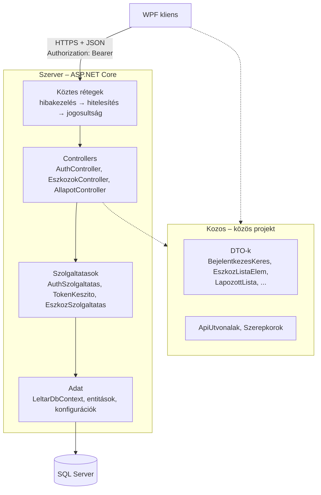
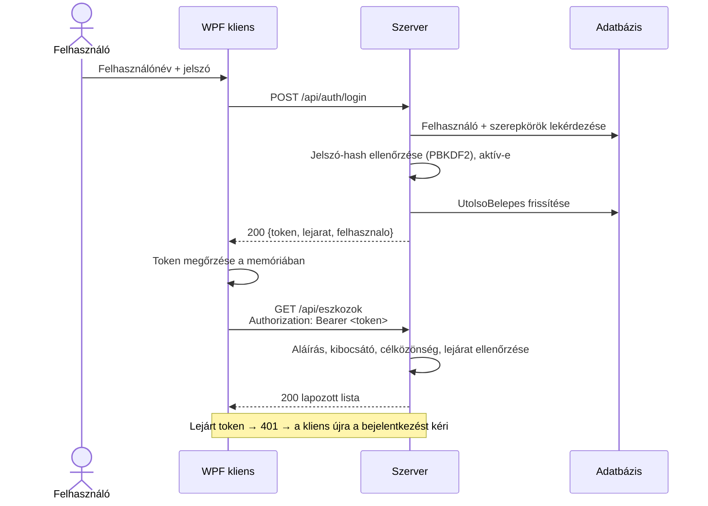

# Szerver proof of concept és kliens–szerver kommunikáció

**Felelős:** Horváth Máté · **Állapot:** a 4. alkalomra elkészült, működő változat

A 4. alkalom célja, hogy a projekt ne csak tervekből álljon. Ez a leírás a szerveroldali technikai alapot mutatja be:
a megoldás szerkezetét, a rétegeket, az elkészült végpontokat, a hitelesítést, a konfigurációt és a kommunikáció
szerződését. A fordítás és a futtatás lépései a [README](../README.md#forráskód)-ben találhatók.

## 1. Mi készült el?

| # | Feladat (`03_alkalom/05_Fejlesztesi_utemterv.md`) | Eredmény |
|---|---|---|
| 1 | Megoldásstruktúra: kliens, szerver, közös projekt | `LeltarKezelo.sln`: `Kliens` (WPF), `Szerver` (ASP.NET Core), `Kozos` (DTO-k), `Szerver.Tesztek` |
| 3 | Kapcsolati adatok konfigurációból, mintafájllal | `appsettings.Local.json` (nem verziókezelt) + `appsettings.Local.example.json` (D-017) |
| 4 | Eszközlista végpont lapozással | `GET /api/eszkozok` – keresés megnevezésre és bármely kódra, körzetszűrés, lapozás |
| 8 | README: fordítás és futtatás | `README.md` → *Forráskód* fejezet |
| – | JWT hitelesítés, a kulcs a repón kívül | `POST /api/auth/login`, `GET /api/auth/en`, alapértelmezett védelem (D-015, D-019) |
| – | Első működő kód bemutatása | Swagger UI, 13 automatikus integrációs teszt |

## 2. Rétegek



| Réteg | Felelősség | Nem feladata |
|---|---|---|
| Controller | HTTP-kérés fogadása, bemenet alapellenőrzése, státuszkód és válasz | Üzleti szabály, adatbázis-hozzáférés |
| Szolgáltatás | Üzleti logika, lekérdezések összeállítása, DTO-vá alakítás | HTTP részletei |
| Adat | Entitások, séma-konfiguráció, `DbContext` | Üzleti döntés |
| Kozos | A kommunikáció szerződése: a kliens és a szerver ugyanazt a típust használja | Logika |

A controllerek vékonyak: egy végpont jellemzően egyetlen szolgáltatáshívás. Az entitások soha nem kerülnek
közvetlenül a válaszba, a lekérdezések közvetlenül DTO-ra vetítenek (`Select`), így csak a szükséges oszlopok jönnek
le az adatbázisból, és a belső adatok (pl. `JelszoHash`, `RowVersion`) nem szivároghatnak ki.

## 3. Végpontok

| Módszer | Útvonal | Hitelesítés | Válasz |
|---|---|---|---|
| GET | `/api/allapot` | nem kell | `SzerverAllapot` – verzió, adatbázis elérhető-e, szerveridő |
| POST | `/api/auth/login` | nem kell | `BejelentkezesValasz` – token, lejárat, felhasználó adatai |
| GET | `/api/auth/en` | kell | `FelhasznaloAdatok` – a tokenből kiolvasott felhasználó és szerepkörök |
| GET | `/api/eszkozok?kereses=&leltarkorzetId=&oldal=&oldalMeret=` | kell | `LapozottLista<EszkozListaElem>` |
| GET | `/api/eszkozok/{id}` | kell | `EszkozReszletek` – kódok kódtípussal együtt |

### 3.1 Bejelentkezés

```http
POST /api/auth/login
Content-Type: application/json

{ "felhasznalonev": "admin", "jelszo": "..." }
```

```json
{
  "token": "eyJhbGciOiJIUzI1NiIsInR5cCI6IkpXVCJ9...",
  "lejarat": "2026-09-29T04:58:10Z",
  "felhasznalo": { "id": 1, "felhasznalonev": "admin", "nev": "Rendszeradminisztrátor", "szerepkorok": ["Admin"] }
}
```

### 3.2 Eszközlista

```http
GET /api/eszkozok?kereses=sap-0001&oldal=1&oldalMeret=50
Authorization: Bearer eyJhbGciOi...
```

```json
{
  "elemek": [
    { "id": 1, "megnevezes": "Asztali számítógép", "eszkozTipus": null, "leltarkorzetKod": "MIK-01",
      "allapot": "aktív", "elvartMennyiseg": 1, "mennyisegiEgyseg": null, "kodok": ["SAP-0001", "L-1001"] }
  ],
  "oldal": 1, "oldalMeret": 50, "osszesen": 1, "oldalakSzama": 1
}
```

- A `kereses` a megnevezésben (részszó) **és** az eszköz bármely aktív kódjában (kezdőrész) keres. A kódkeresés a
  normalizált értéken történik (D-012), így a `" sap-0001 "` és a `SAP-0001` ugyanazt találja.
- Az `oldalMeret` legfeljebb 200; nagyobb kérésnél a szerver 200-ra korlátoz, a válasz `oldalMeret` mezője a
  ténylegesen használt értéket mutatja.
- A rendezés megnevezés, azon belül azonosító szerint történik, így a lapok stabilak (egy tétel nem kerülhet két
  lapra).

### 3.3 Hibák

Minden hiba szabványos Problem Details (RFC 9457) objektum (D-018):

```json
{
  "type": "https://tools.ietf.org/html/rfc9110#section-15.5.2",
  "title": "Unauthorized",
  "status": 401,
  "detail": "Hibás felhasználónév vagy jelszó.",
  "traceId": "00-a657468855d3d104d2cd1cc784c676f8-711338674204d082-00"
}
```

| Státusz | Mikor |
|---|---|
| 400 | Hiányzó vagy érvénytelen bemenet (pl. üres felhasználónév) |
| 401 | Nincs, lejárt vagy hamis token; hibás belépési adatok |
| 403 | Érvényes token, de a szerepkör nem jogosult (a szerepkör-korlátozások bevezetésével) |
| 404 | Nem létező erőforrás |
| 500 | Váratlan szerverhiba – a részletek csak a szerver naplójában |

A `traceId` alapján a szerver naplójában visszakereshető az adott kérés.

## 4. Hitelesítés



- **Jelszótárolás:** a jelszó soha nem tárolódik, csak az ASP.NET Core `PasswordHasher` által előállított sózott
  PBKDF2-hash. Ha a hash-algoritmus paraméterei egy későbbi verzióban erősödnek, a szerver belépéskor automatikusan
  újrahasheli a jelszót.
- **Egységes hibaüzenet:** nem létező, inaktív felhasználó és hibás jelszó esetén ugyanaz a válasz, így kívülről nem
  deríthető ki, mely felhasználónevek léteznek.
- **Token tartalma:** `sub` (felhasználó azonosítója), `unique_name`, `name`, szerepkörök, `jti`, lejárat.
  Aláírás: HMAC-SHA256, a `Jwt:Kulcs` titkos kulccsal. Alapértelmezett érvényesség: 8 óra (egy munkanap).
- **Alapértelmezett védelem:** minden végpont hitelesítést kér, kivéve a bejelentkezést és az állapotlekérdezést
  (D-019).
- **Kezdő adminisztrátor:** fejlesztői módban, ha a felhasználótábla üres, a szerver a `KezdoAdmin` beállításokból
  létrehozza az első adminisztrátort, és hiányzó szerepköröket is felveszi. Éles módban ez nem fut.

### 4.1 Jogosultsági mátrix – első változat

A szerepkörök a `02_alkalom/03_Felhasznalok_es_hasznalati_esetek.md` szerint. A szerepkör-ellenőrzés a végpontok
elkészültével kerül be (`[Authorize(Roles = ...)]`); a PoC-ban minden bejelentkezett felhasználó olvashat.

| Művelet | Admin | Leltárfelelős | Leltározó | Megtekintő |
|---|---|---|---|---|
| Eszközlista, részletek megtekintése | ✅ | ✅ | ✅ (jogosult körzetek) | ✅ (saját egység) |
| Excel import | ✅ | ✅ | | |
| Eszköz felvitele, módosítása, állapotváltozás | ✅ | ✅ | | |
| Törzsadatok (körzet, helyiség, típus, felelős) | ✅ | ✅ | | |
| Leltáridőszak nyitása, lezárása | ✅ | ✅ | | |
| Beolvasás rögzítése | ✅ | ✅ | ✅ (jogosult körzetek) | |
| Saját leolvasás sztornózása | ✅ | ✅ | ✅ | |
| Más leolvasásának sztornózása | ✅ | ✅ | | |
| Összehasonlítás, riportok | ✅ | ✅ | ✅ (saját körzet) | ✅ (saját egység) |
| Felhasználók, szerepkörök kezelése | ✅ | | | |
| Lezárt leltár módosítása | | | | |

## 5. Konfiguráció

| Kulcs | Hol | Titkos? | Leírás |
|---|---|---|---|
| `ConnectionStrings:Leltar` | `appsettings.Local.json` | igen (jelszót tartalmazhat) | SQL Server kapcsolati adat |
| `Jwt:Kulcs` | `appsettings.Local.json` | **igen** | Token aláíró kulcs, legalább 32 karakter |
| `Jwt:Kibocsato`, `Jwt:Celkozonseg` | `appsettings.json` | nem | A token kibocsátója és célközönsége |
| `Jwt:ErvenyessegPerc` | `appsettings.json` | nem | Token érvényessége percben (5–1440) |
| `KezdoAdmin:Felhasznalonev`, `KezdoAdmin:Jelszo` | `appsettings.Local.json` | igen | Csak fejlesztői módban használt |

A beállítások sorrendje (a későbbi felülírja a korábbit): `appsettings.json` → `appsettings.{Környezet}.json` →
`appsettings.Local.json` → környezeti változók → parancssori argumentumok. A szerver induláskor ellenőrzi a JWT
beállításokat; hibás vagy hiányzó kulcs esetén el sem indul, és a hibaüzenet megmondja, mi hiányzik.

## 6. Adatréteg a PoC-ban

A szerver a végpontjaihoz szükséges entitásokat (`Eszkoz`, `EszkozKod`, `KodTipus`, `EszkozTipus`, `Leltarkorzet`,
`EszkozAllapot`, `Felhasznalo`, `Szerepkor`) az Adatmodell v1 (`03_alkalom/03_Adatmodell_v1.md`) elnevezéseivel és
megszorításaival tartalmazza, többek között:

- `EszkozKod.ErtekNorm` tárolt számított oszlop: `UPPER(LTRIM(RTRIM([Ertek])))`;
- szűrt egyedi index az aktív kódokra: `IX_EszkozKod_ErtekNorm ... WHERE [Aktiv] = 1`;
- `CHECK ([ElvartMennyiseg] > 0)`, `rowversion` az `Eszkoz` táblán;
- minden idegen kulcson `Restrict` törlési viselkedés, `datetime2(3)` időbélyegek, `decimal(18,2)` pénzérték.

Ezeket SQL Server Expressen kipróbáltuk: az ismételt aktív kód beszúrását az adatbázis elutasítja, a normalizált
érték automatikusan kitöltődik. Az első migrációt, a teljes sémát és a tesztadat-feltöltőt Kiss Barnabás készíti el
erre az alapra.

## 7. Tesztek

`tests/Szerver.Tesztek` – a szerver a valódi HTTP-csővezetékkel (hitelesítés, jogosultság, szerializálás) indul el,
csak az adatbázis cserélődik memóriabelire (`WebApplicationFactory`).

| Teszt | Mit ellenőriz |
|---|---|
| `Allapot_bejelentkezes_nelkul_elerheto` | Nyilvános végpont, adatbázis-kapcsolat jelzése |
| `Eszkozlista_token_nelkul_401` | Alapértelmezett védelem |
| `Hibas_bejelentkezes_401` (3 eset) | Rossz jelszó, nem létező és inaktív felhasználó, Problem Details formátum |
| `Ures_bejelentkezesi_adat_400` | Bemenet ellenőrzése |
| `Tokenbol_kiolvashato_a_felhasznalo_es_szerepkore` | A token tartalma és a szerepkörök |
| `Eszkozlista_lapoz` | Lapozás, összes elem száma, lapok átfedésmentessége |
| `Eszkozlista_barmely_kod_alapjan_keres_normalizalva` | Keresés másodlagos kódra, kis- és nagybetű, szóközök |
| `Eszkozlista_korzetre_szur` | Körzetszűrés |
| `Tul_nagy_oldalmeret_korlatozva` | Oldalméret felső korlátja |
| `Eszkoz_reszletei_kodtipussal` | Részletek, kódtípusok |
| `Nem_letezo_eszkoz_404` | Nem létező erőforrás |

Eredmény: **13/13 sikeres**.

## 8. Kapcsolódás a többi réteghez

| Kinek | Mit ad a szerver | Mit vár |
|---|---|---|
| Kliens (Bárkányi Máté) | `Kozos` projekt: DTO-k és `ApiUtvonalak`; a hibák egységes Problem Details formátumban | A token a kérések `Authorization: Bearer` fejlécében; 401-re újra bejelentkezés |
| Adat (Kiss Barnabás) | Entitások és `IEntityTypeConfiguration` osztályok az Adatmodell v1 szerint | Első migráció, a további entitások, kezdeti adatok, tesztadat-feltöltő |

## 9. Következő lépések (5–6. alkalom)

- Törzsadat-végpontok (leltárkörzetek, kódtípusok, eszköztípusok, állapotok) a kliens szűrőihez.
- Import végpont (`POST /api/importok`) a C réteg import szolgáltatásához.
- Szerepkör szerinti korlátozás a jogosultsági mátrix alapján, leltárkörzet-jogosultság.
- Leltáridőszak és leolvasás végpontok, a beolvasás minősítése (`OK`, `MAS_KORZET`, `ISMETELT`, ...).
